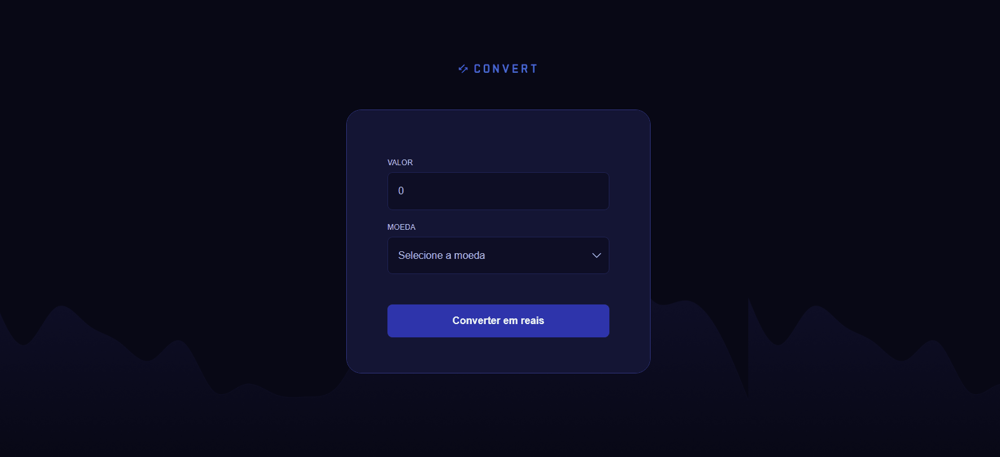

# Conversor de Moedas

App desenvolvido para por em prática os conhecimentos fundamentais de Javascript.

Obs.: O valor da cotação é fictício.

<p align="center">
  
</p>

## 💻 Tecnologias utilizadas

- HTML 5  
- CSS 3
- Javascript ES6+
- <a href="https://www.figma.com/community/file/1360315742205904074" target="_blank">Figma (como referência visual)</a>

## ▶️ Como executar

1. Clone o repositório:
   ```bash
   git clone https://github.com/danillo-fullstack/convert-template.git

2. Acesse a pasta do projeto:
   ```bash
   cd nome-do-repo

- [Acesse o projeto finalizado, online](https://danillo-fullstack.github.io/convert-template/)

---

Feito em parceria com a Rocketseat